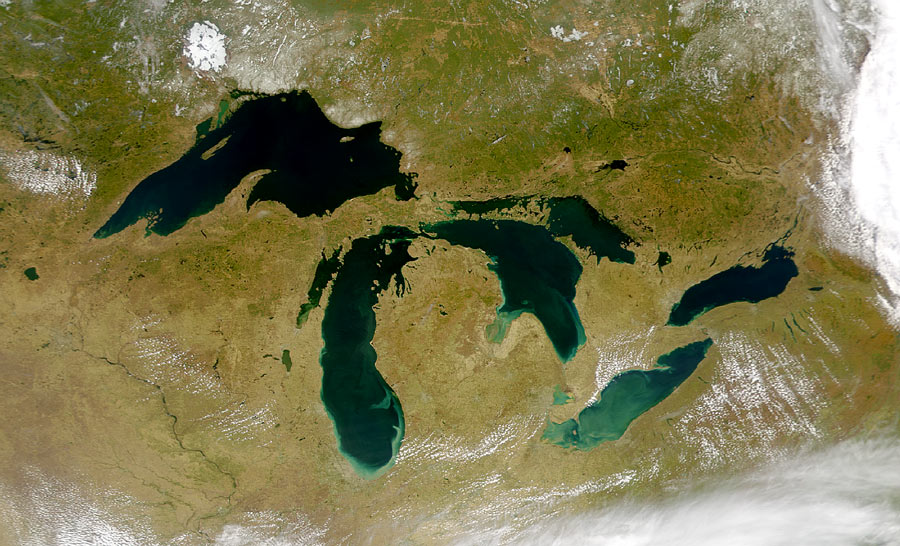

五大湖 Great Lakes

| 法语            | 英语            | 中文（简体） | 中文（繁体） |
|---------------|---------------|--------|--------|
| Lac Supérieur | Lake Superior | 苏必略湖   | 蘇必略湖   |
| Lac Michigan  | Lake Michigan | 密西根湖   | 密西根湖   |
| Lac Huron     | Lake Huron    | 休伦湖    | 休倫湖    |
| Lac Èrié      | Lake Erie     | 伊利湖    | 伊利湖    |
| Lac Ontario   | Lake Ontario  | 安大略湖   | 安大略湖   |

卫星照片：

